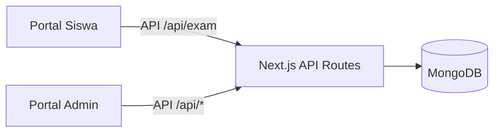

# Platform Asesmen Digital SMKN 31 Jakarta

Platform ujian digital berbasis web untuk asesmen Matematika kelas XI. Sistem ini memfasilitasi alur siswa dari biodata hingga submit jawaban, serta portal admin untuk bank soal, sesi ujian, dan rekap hasil.

## Ringkasan

- Fokus utama: pelaksanaan ujian terstruktur, auto-save, anti-cheat, dan koreksi essay oleh admin.
- Model data tersimpan di MongoDB menggunakan Mongoose.
- Admin menggunakan autentikasi JWT berbasis cookie HttpOnly.
- Siswa menggunakan biodata (nama, kelas, absen) tanpa login akun.

## Fitur Utama

### Siswa

- Form biodata sebelum ujian (nama, kelas, nomor absen).
- Pembagian ujian menjadi 3 bagian: Menjodohkan, Pilihan Ganda/Kompleks, Essay.
- Auto-save jawaban (debounce 1.5 detik) ke server.
- Timer ujian dengan status warning saat waktu menipis.
- Anti-cheat: deteksi keluar tab, klik kanan, dan copy.
- Opsi pilihan ganda diacak per siswa dengan seed stabil.
- Halaman hasil menampilkan status ujian dan indikasi pelanggaran.

### Admin

- Login admin dengan email dan password.
- Dashboard statistik dan ringkasan submission terbaru.
- CRUD bank soal dan pengaturan poin.
- CRUD sesi ujian: pilih soal, atur kelas, durasi, dan status aktif.
- Tinjau hasil ujian, koreksi essay, dan update nilai.
- Rekap PDF per kelas dari halaman hasil.

## Arsitektur Singkat



## Teknologi

- Next.js 16 (App Router), React 19
- MongoDB + Mongoose
- Tailwind CSS v4
- jose (JWT), bcryptjs
- Radix UI, Recharts, Framer Motion

## Struktur Folder Inti

- src/app: routing halaman (siswa, admin, auth, API routes)
- src/components: komponen UI siswa dan admin
- src/hooks: auto-save dan anti-cheat
- src/lib: auth, mongo, grading, shuffle opsi
- src/models: schema Mongoose
- src/seed: seed admin dan bank soal

## Model Data

- User: admin atau siswa (admin menggunakan email; siswa menggunakan NISN opsional)
- Question: tipe soal, opsi, kunci jawaban, poin
- ExamSession: sesi ujian, daftar soal, durasi, kelas yang diizinkan
- Answer: biodata siswa, jawaban, skor, status submit, pelanggaran
- Violation: log aktivitas pelanggaran per submission

## API Utama

### Auth

- POST /api/auth/login
  - Body: { identity, password, role }
  - Role admin menggunakan email, siswa menggunakan NISN
- POST /api/auth/logout

### Exam (Siswa)

- POST /api/exam/start
  - Body: { sessionId?, submissionId?, studentName?, studentClass?, studentAbsen? }
  - Jika sessionId tidak valid, sistem mengambil sesi aktif pertama
  - Mengembalikan daftar soal tanpa correctAnswer
- PATCH /api/exam/answer
  - Body: { sessionId, submissionId, questionId, answer }
  - Auto-grade untuk matching dan pilihan ganda
- POST /api/exam/submit
  - Body: { sessionId, submissionId, forceSubmit? }
  - Hitung skor objektif dan grade
- POST /api/exam/violation
  - Body: { sessionId, submissionId, type, count }
  - Mencatat pelanggaran dan bisa terminasi ujian
- GET /api/exam/result?submissionId=...
  - Ringkasan status submission

### Admin (Protected)

- GET /api/questions?type=...
- POST /api/questions
- PUT /api/questions/:id
- DELETE /api/questions/:id

- GET /api/sessions
- POST /api/sessions
- GET /api/sessions/:id
- PUT /api/sessions/:id
- DELETE /api/sessions/:id

- GET /api/results
- GET /api/results/:id
- PUT /api/results/:id (koreksi essay)

## Penilaian dan Skor

- Matching: 1 poin per pasangan benar.
- Pilihan ganda / kompleks: 1 poin per soal benar.
- Essay: dinilai manual oleh admin.
- Grade: A (>= 90), B (>= 75), C (>= 60), D (>= 45), E (< 45).

## Anti-Cheat

- Client mencatat: tab switch (visibilitychange), klik kanan, copy.
- Server menyimpan log pelanggaran dan terminasi otomatis jika melebihi batas.
- Batas pelanggaran diset via env (MAX_VIOLATIONS / NEXT_PUBLIC_MAX_VIOLATIONS).

## Setup Lokal

### Prasyarat

- Node.js LTS
- MongoDB (lokal atau Atlas)

### Environment Variables

Buat file .env.local:

```
MONGODB_URI=mongodb+srv://<user>:<password>@cluster.mongodb.net/asesmen
JWT_SECRET=ubah_dengan_string_aman
MAX_VIOLATIONS=3
NEXT_PUBLIC_MAX_VIOLATIONS=3
ADMIN_DEFAULT_EMAIL=admin@smkn31.sch.id
ADMIN_DEFAULT_PASSWORD=Admin@123
```

### Install dan Jalankan

```bash
npm install
npm run dev
```

Akses:

- Portal siswa: http://localhost:3333
- Portal admin: http://localhost:3333/login

### Seed Data (Admin dan Soal)

Gunakan runner TypeScript, contoh dengan tsx:

```bash
npx tsx src/seed/admin.ts
npx tsx src/seed/questions.ts
```

## Operasional Admin

- Buat bank soal di menu Bank Soal.
- Buat sesi ujian di menu Sesi Ujian (pilih soal, durasi, kelas, dan aktifkan).
- Bagikan link sesi (tombol Salin Link).
- Pantau hasil di menu Hasil Ujian dan koreksi essay.
- Rekap PDF tersedia di tombol Rekap PDF.

## Catatan Implementasi Penting

- Portal siswa tidak menggunakan JWT; validasi dilakukan melalui biodata + submissionId.
- Halaman /exam menggunakan sessionId dummy, namun sistem akan mengambil sesi aktif jika sessionId tidak valid.
- Opsi pilihan ganda diacak per siswa menggunakan seed dari nama dan absen; jawaban tetap disimpan sebagai key asli.
- Halaman hasil siswa tidak menampilkan skor akhir, hanya status dan info pelanggaran.

## Deployment

Rekomendasi: Vercel.

```bash
npm run build
npm run start
```

Pastikan semua env vars sudah diset di environment production.
